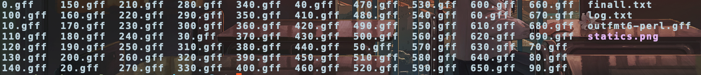
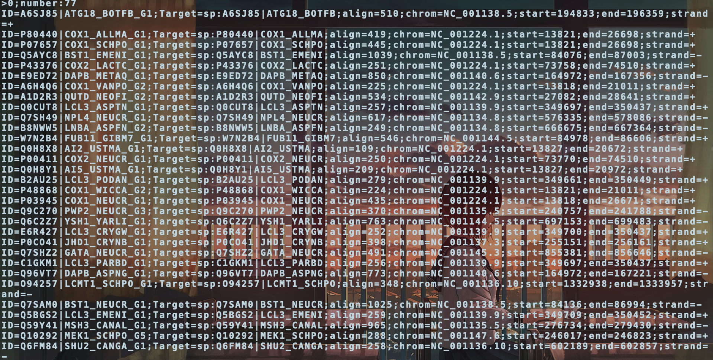
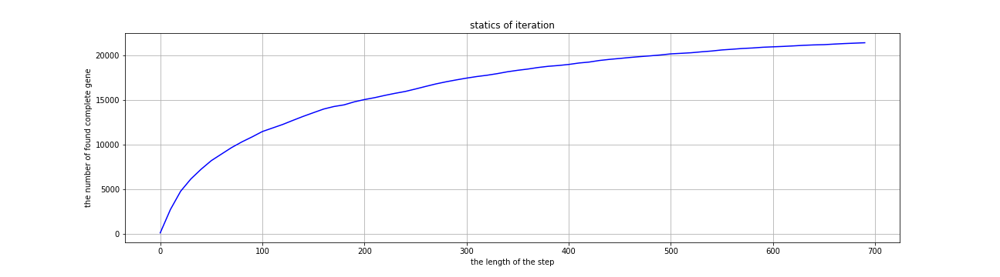

<h2>Find Complete Gene  (FCG)</h2>
<h3>如何使用这个程序。</h3>
git clone git@github.com:wenyuhaokikika/FCG.git

mkdir run

cd run

Python3 -m venv .

source ./venv/bin/activate

pip install -r requeriments

python FCG.py —help可以查看帮助信息。

python FCG.py —step 10 —maxlen 700 —gfffile outfmt6-perl.gff —fnafile GCF_000146045.2_R64_genomic.fna

就会得倒result文件夹。

<h3>如何查看结果文件。</h3>
结果文件在同目录下result中存放。

1，n.gff为向两端延伸n个bp长度所查找到的完整基因的gff文件（不包括以前找到的，仅仅只是这一步找到的完整基因）。

2，outfmt-perl.gff是和输入gff文件同名的文件，每次迭代之后都会有更新，最后得倒的是延长迭代后依然不是完整的基因的gff文件。

3，log.txt是把每一步找到的基因记录下来（包括以前找到的的基因, 很大）。格式为：#step为向两端衍生的长度，n为这一步找到的基因数目。

step;number:n

基因1

基因2

......

如下：

4，statics.png是每次找到（包含之前找到的）完整基因的曲线图。

